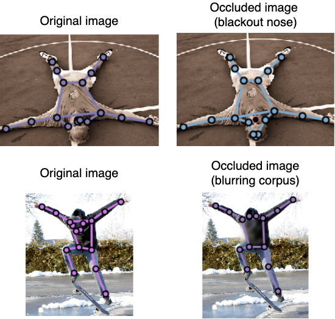
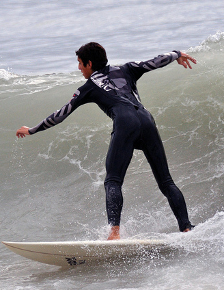
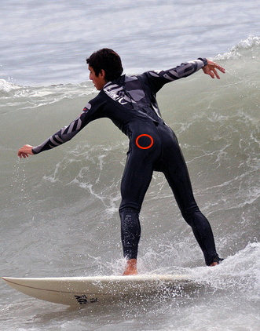
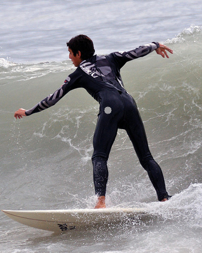
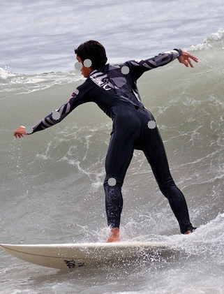
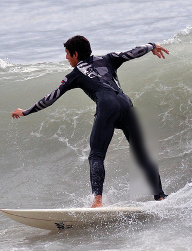
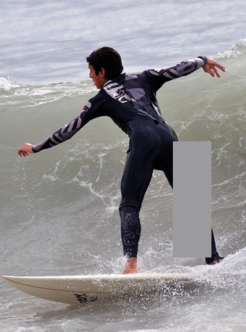
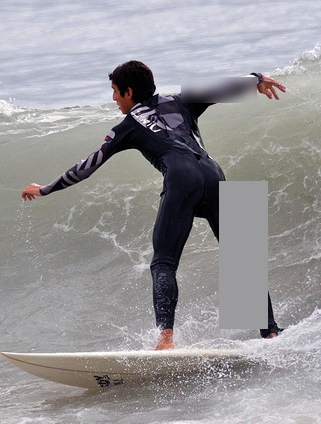
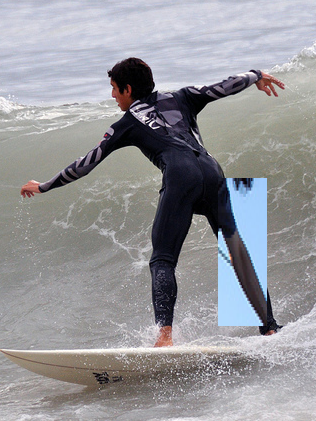
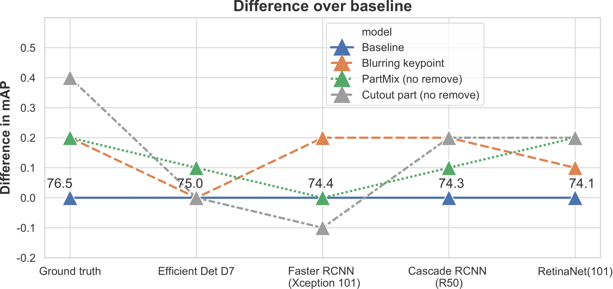

# [Tilting at windmills: Data augmentation for deep pose estimation does not help with occlusions](https://arxiv.org/abs/2010.10451)

In [ICPR 2020](https://arxiv.org/abs/2010.10451). Rafal Pytel, [Osman Semih Kayhan](https://oskyhn.github.io/) and [Jan van Gemert](http://jvgemert.github.io/index.html). 

Detailed blog coming soon. 

This repository contains code adapted to the usage of the proposed targeted occlusion augmentations. 

## Table of content
1. [Definition of the problem](#definition-of-the-problem).
2. [Example of proposed augmentations](#example-of-proposed-augmentations).
3. [Qualitative examples of model trained with proposed augmentations](#qualitative-examples)
4. [Results on COCO](#results-on-coco).
5. [Results on MPII](#results-on-mpii).
## Definition of the problem
</td>

There are indications that with the presence of occlusion, quality of prediction for the position of human joints is worse. 
As can be seen on the figure above in the first row when we introduce occlusion on the nose all the key points of the face
 get shifted, while in the second row, it is clear that head joints are shifted after blurring torso. 
## Example of proposed augmentations
<table>
  <tr>
    <td>Original image</td>
     <td>Blurring (K)</td>
     <td>Cutout (K)</td>
  <td>Multi keypoint Cutout</td>
  </tr>
  <tr>
    <td></td>
    <td></td>
    <td></td>
    <td></td>

  </tr>
  <tr>
    <td>Blurring (P)</td>
     <td>Cutout (K)</td>
     <td>Blurring (P) + Cutout (P)</td>
  <td>PartMix</td>
  </tr>
  <tr>
  <td></td>
    <td></td>
    <td></td>
    <td></td>
   </tr>
 </table>
 
## Qualitative examples
</td>

Qualitative  comparison  between  ground  truth  (left),baseline  (middle)  and  keypoint  Blurring  (K)  (right).  
1st  and 2nd  rows  respectively  - misplacement of left wrist keypoint and mismatch between knee keypoints in the  
baseline and keypoint blurring fixes the mistakes. 3rd row - both baseline and proposed method produce wrong keypoints.
4th row - baseline produces near-optimal keypoints whilst keypoint blur-ring makes mistake on left ankle keypoint.

## Results on COCO
### Results for HR HRNet
</td>

### Results for Higher HRNet
| Augmentation            | AP   | AP@50 | AP@75 | AP@M | AP@L |
|-------------------------|------|-------|-------|------|------|
| Baseline (Higher HRNet) | 67.1 | 86.2  | 73.0  | 61.5 | 76.1 |
| Blurring (K)            | 66.5 | 86.3  | 72.1  | 60.6 | 75.7 |
| Cutout part (no remove) | 66.6 | 86.4  | 72.9  | 60.7 | 75.6 |
| PartMix (no remove)     | 67.0 | 86.4  | 73.0  | 61.3 | 75.8 |
## Results on MPII
| Augmentation | Head | Shoulder | Elbow | Wrist | Hip  | Knee | Ankle | Total |
|--------------|------|----------|-------|-------|------|------|-------|-------|
| Baseline     | 97.1 | 95.9     | 90.4  | 86.4  | 89.1 | 87.2 | 83.3  | 90.3  |
| Blurring (K) | 97.3 | 95.9     | 90.5  | 86.2  | 89.2 | 86.4 | 83.1  | 90.3  |
| Cutout (P)   | 97.2 | 96.3     | 90.7  | 86.7  | 89.4 | 86.7 | 83.3  | 90.5  |
| PartMix      | 97.4 | 96.2     | 91.0  | 86.8  | 89.2 | 86.7 | 83.0  | 90.5  |
## Citation
If you find this work or code is helpful in your research, please cite:
```
@misc{pytel2020tilting,
      title={Tilting at windmills: Data augmentation for deep pose estimation does not help with occlusions}, 
      author={Rafal Pytel and Osman Semih Kayhan and Jan C. van Gemert},
      year={2020},
      eprint={2010.10451},
      archivePrefix={arXiv},
      primaryClass={cs.CV}
}
```